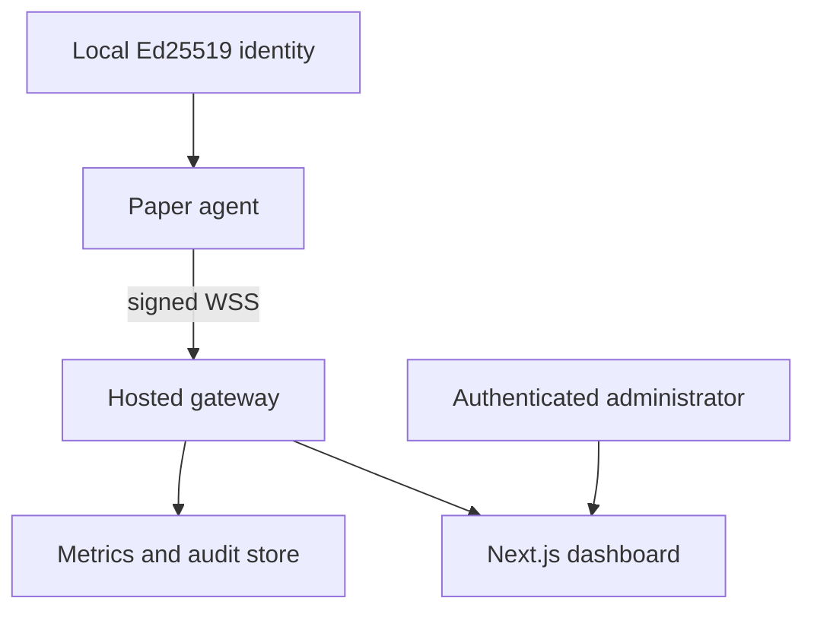

# Architecture

PlexonPanel separates the Paper agent from the Internet-facing control plane. A game server opens one outbound WebSocket connection; the dashboard never connects directly to the Minecraft port or plugin.

## Agent boundaries

| Boundary | Responsibilities |
| --- | --- |
| Paper main thread | TPS/tick/player/plugin snapshots and every server mutation |
| System worker | OS/JVM/disk metrics only |
| Console worker | Tail new log bytes, truncate oversized lines, classify, redact, batch |
| Gateway scheduler/sender | WebSocket lifecycle, signature verification, replay checks, bounded outbound queue |
| Audit worker | Append minimized action records and expire old daily files |

No worker invokes Bukkit/Paper stateful APIs. The gateway client captures immutable server-version strings during plugin startup for its hello message.

## Identity and pairing

1. On first start, the agent generates an Ed25519 key pair and random server ID.
2. The private PKCS#8 key remains in `plugins/PlexonPanel/identity/device.key`; the X.509 public key is included in the signed hello.
3. The gateway proves possession of its configured private key by signing messages with the pinned public-key counterpart.
4. An operator requests a short-lived code with `/plexonpanel pair` and enters it while authenticated in the dashboard.
5. The gateway binds that user/organization to the device public key and acknowledges completion.
6. Later connections authenticate by signatures, not by reusing the short pairing code.

The hosted implementation must make code redemption atomic, rate-limit guesses, scope a code to a device, store only the minimum required identity data, and revoke old device keys after rotation.

## Backpressure and failure behavior

- The outbound queue is bounded. Critical results may evict noncritical telemetry; messages are never written to an unbounded offline spool.
- Console history is intentionally dropped while disconnected.
- Metrics are sampled again after reconnect, so stale telemetry is unnecessary.
- WebSocket reconnect delay grows exponentially to a configured maximum.
- Remote requests outside the configured time window or with reused IDs are rejected.
- An unavailable or unconfigured verification key locks privileged messages even in development mode.

## Hosted control-plane requirements

The gateway/dashboard milestone should include account authentication and MFA, organization/server RBAC, per-device public-key records, encrypted database/storage, rate limits, CSRF protections, short WebSocket session lifetimes, durable action audit events, secret rotation, tenant-isolation tests, and an explicit retention/deletion model.
